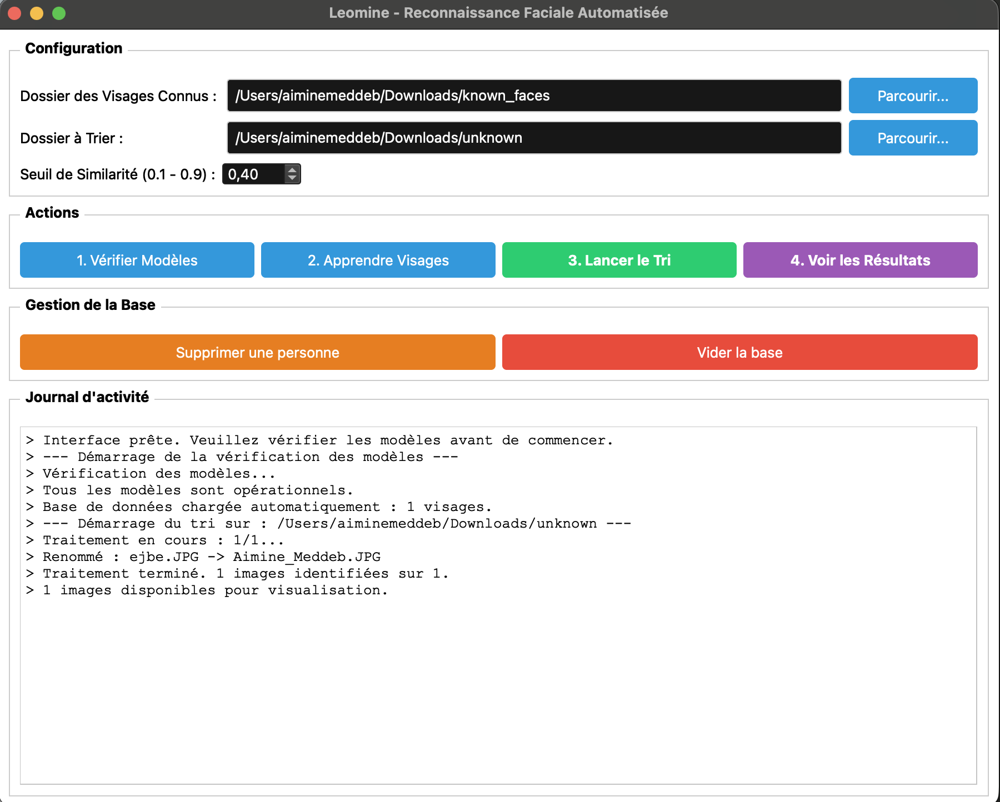
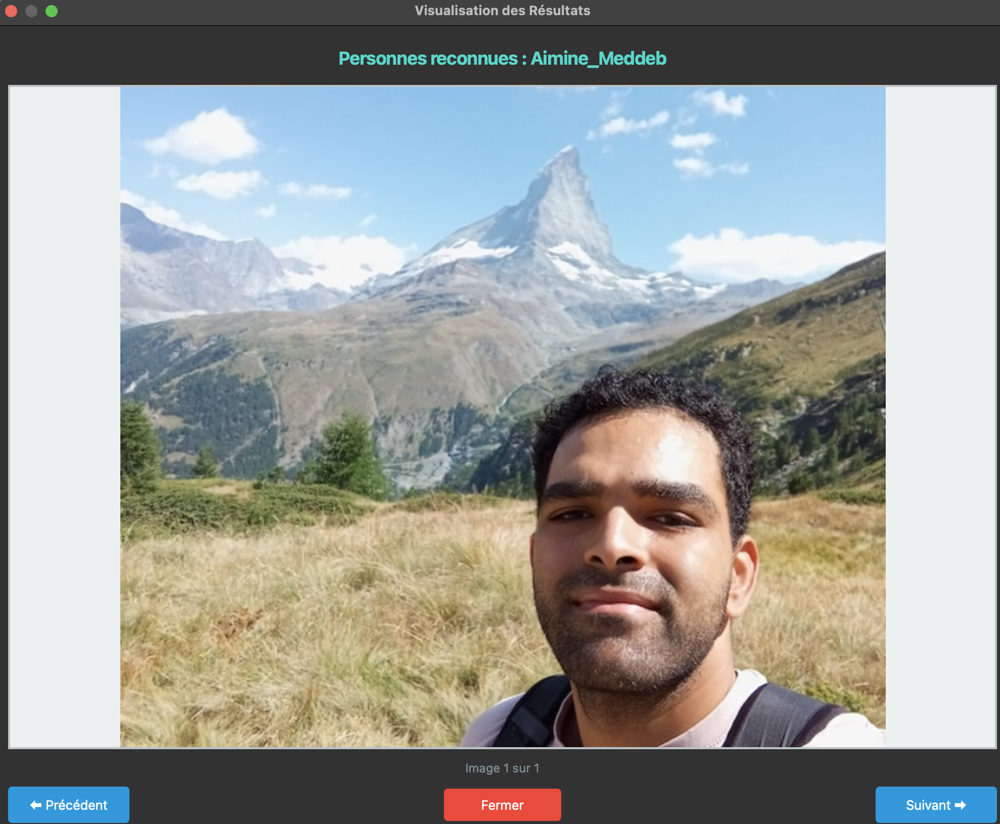

# Système de Reconnaissance Faciale Automatique

Ce projet présente une application concrète de reconnaissance faciale développée en Python. L'objectif est de fournir un outil capable d'identifier des individus sur des photos ou en temps réel via une webcam, afin de faciliter notamment le tri automatique de larges volumes d'images. 

En combinant les modèles de Deep Learning YuNet (pour la détection) et SFace (pour la reconnaissance), l'application démontre la mise en place d'un pipeline de vision par ordinateur complet : de la gestion d'une base de données de visages à l'extraction de caractéristiques, le tout rendu accessible via une interface utilisateur intuitive.

### Aperçu du projet

**Interface principale et résultats d'analyse :**



**Démonstration en temps réel (Webcam) :**


---

## Installation

### Prérequis

- Python 3.10 ou supérieur
- macOS, Linux ou Windows
- Webcam (optionnel, pour le mode temps réel)

### Installation des Dépendances

```bash
# Avec uv (recommandé)
uv sync

# Ou avec pip
pip install -e .
```

## Organisation des Données

### Structure des Dossiers

Le projet nécessite une organisation spécifique des images :

#### Visages Connus (pour l'entraînement)

Créez un dossier `known_faces/` avec un sous-dossier par personne :

```text
known_faces/
├── Aimine_Meddeb/
│   ├── photo1.jpg
│   ├── photo2.png
│   └── selfie.jpeg
├── Leonard_Beddouk/
│   ├── image_01.jpg
│   └── portrait.png
```

#### Points importants

- Le nom du dossier sera utilisé comme identifiant
- Plusieurs photos par personne améliorent la précision (des photos de profils, de face, de trois quarts)
- Les photos doivent être nettes et bien éclairées (type photo d'identité)

#### Visages Inconnus (à identifier)

Placez les photos à traiter dans `unknown_faces/` :

```text
unknown_faces/
├── vacances_2023_001.jpg
├── DSC_0982.png
└── random_img.jpeg
```

## Utilisation de l'Interface Graphique

### Étape 1 : Lancement

```bash
uv run main_qt
```

Ou double-cliquez sur `Lancer_Interface.command` (macOS).

### Étape 2 : Vérification des Modèles

1. Cliquez sur **"1. Vérifier Modèles"**
2. Les modèles ONNX seront téléchargés automatiquement si nécessaire
3. Attendez le message de confirmation

> **Note** : Les modèles (YuNet + SFace) pèsent environ 39 MB au total. À noter que si vous possédez déjà les fichiers du projet `Face_recognition_deep_learning`, il est possible de les utiliser directement pour éviter le téléchargement. Le chargement de ces fichiers existants doit cependant se faire manuellement, le système ne les récupérant pas automatiquement.

### Étape 3 : Entraînement

1. Cliquez sur **"Parcourir"** à côté de "Dossier visages connus"
2. Sélectionnez votre dossier avec les visages connus
3. Cliquez sur **"2. Apprendre Visages"**
4. Le système va :
   - Parcourir chaque sous-dossier
   - Détecter les visages dans chaque image
   - Extraire les caractéristiques faciales
   - Sauvegarder dans `encodings_data/`

> **Astuce** : Plus vous fournissez de photos par personne, meilleure sera la reconnaissance surtout si les photos sont variées (de face, de profil, de trois quarts).

### Étape 4 : Traitement

1. Cliquez sur **"Parcourir"** à côté de "Dossier à traiter"
2. Sélectionnez votre dossier avec les visages inconnus
3. Ajustez le **seuil de reconnaissance** si nécessaire (0.0 à 1.0)
   - **0.3-0.4** : Strict (peu de faux positifs)
   - **0.4-0.5** : Équilibré
   - **0.5+** : Permissif (plus de détections)
4. Cliquez sur **"3. Lancer le Tri"**
5. Les fichiers seront renommés automatiquement

### Étape 5 : Visualisation

1. Cliquez sur **"4. Voir les Résultats"**
2. Naviguez avec les boutons **Précédent/Suivant**
3. Les noms détectés s'affichent sous chaque image

## Gestion de la Base de Données

### Supprimer une Personne

1. Cliquez sur **"Supprimer une personne"**
2. Entrez le nom exact (ex: "Aimine_Meddeb")
3. Confirmez la suppression

> **Attention** : Cette action est irréversible ! Vous devrez réentraîner pour rajouter la personne.

### Vider la Base Complète

1. Cliquez sur **"Vider la base de données"**
2. Confirmez l'action

> **Danger** : Cela supprime TOUS les visages enregistrés !

## BONUS : Mode Webcam (Temps Réel) (optionnel non implémenté)

### Lancement

```bash
uv run webcam
```

Ou double-cliquez sur `Lancer_Webcam.command` (macOS).

### Utilisation

- Les visages détectés sont entourés d'un rectangle :
  - **Vert** : Personne reconnue (nom + score affiché)
  - **Rouge** : Inconnu
- Appuyez sur **'q'** pour quitter

> **Note** : Assurez-vous d'avoir entraîné le système (Étape 3) avant d'utiliser le mode webcam !
